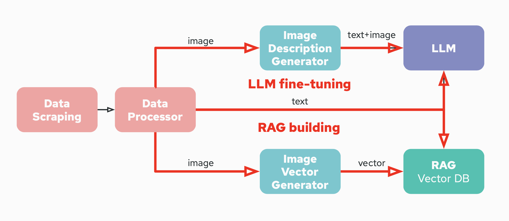
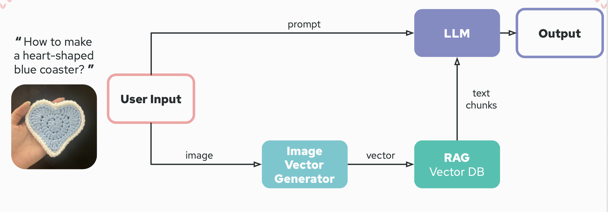
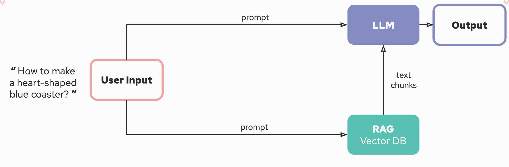
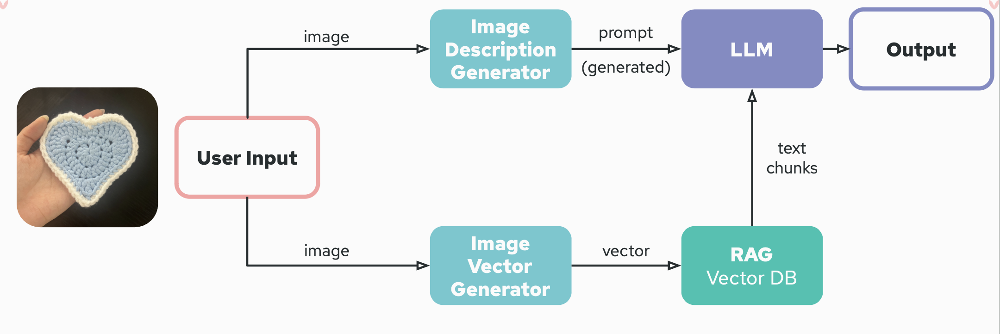
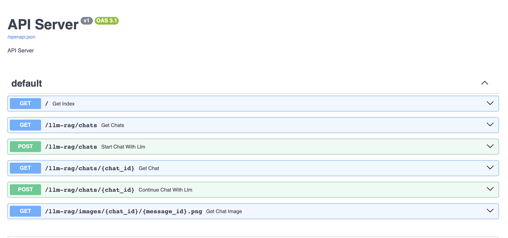
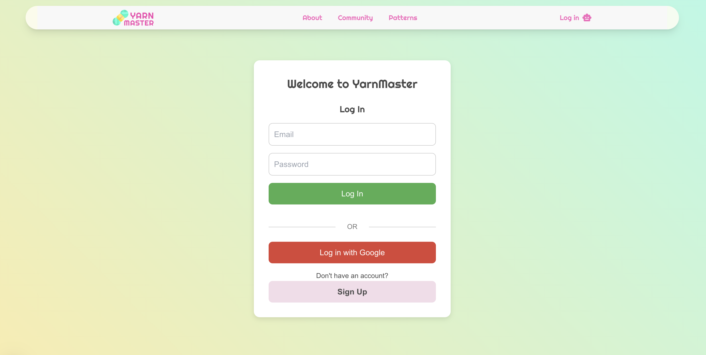
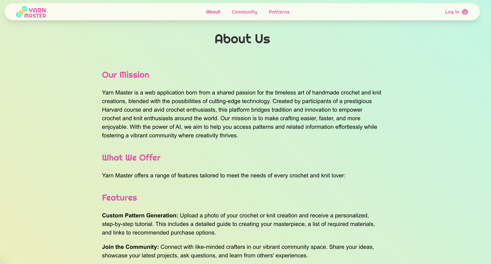
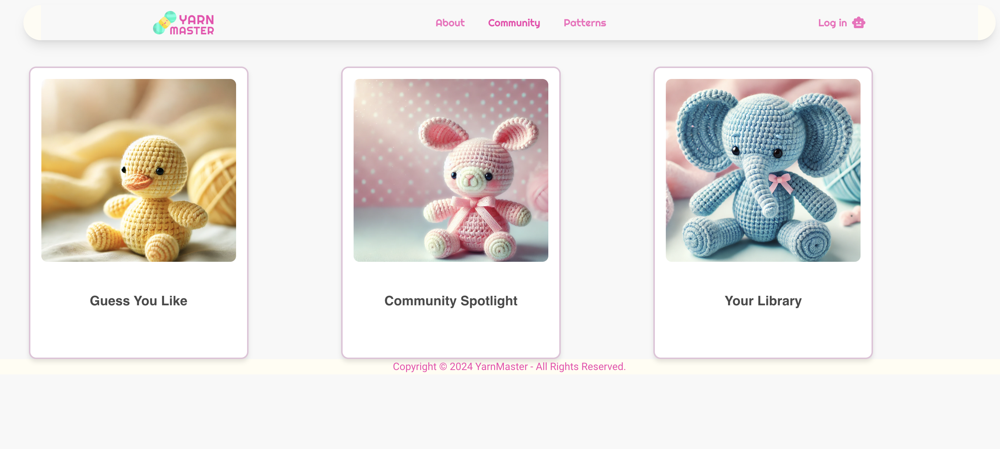

#### Project Organization

```
├── Readme.md
├── data 
├── notebooks
│   └── eda.ipynb
├── references/
├── reports
│   └── APCOMP215 Proposal.pdf
├── tests
│   ├── documentations.txt
│   ├── test_ImageDescription.py
│   ├── test_ImageVector.py
│   ├── test_integration.py
│   └── test_pdfProcessor.py
└── src
    ├── data_gathering
    │   ├── Pipfile
    │   ├── Pipfile.lock
    │   ├── docker-shell.sh
    │   ├── docker-entrypoint.sh
    │   ├── cli.py
    │   ├── data_scraping.py
    │   ├── data_upload.py
    ├── image_descriptions
    │   ├── Pipfile
    │   ├── Pipfile.lock
    │   ├── docker-shell.sh
    │   ├── docker-entrypoint.sh
    │   ├── Dockerfile
    │   ├── echo
    │   ├── cli.py
    ├── pdf_processor
    │   ├── Pipfile
    │   ├── Pipfile.lock
    │   ├── docker-shell.sh
    │   ├── docker-entrypoint.sh
    │   ├── Dockerfile·
    │   ├── cli.py
    ├── image_2_vector
    │   ├── Pipfile
    │   ├── Pipfile.lock
    │   ├── docker-shell.sh
    │   ├── docker-entrypoint.sh
    │   ├── Dockerfile
    │   ├── cli.py
    ├── llm_rag
    │   ├── Pipfile
    │   ├── Pipfile.lock
    │   ├── docker-shell.sh
    │   ├── docker-entrypoint.sh
    │   ├── docker-shell.sh
    │   ├── docker-compose.yml
    │   ├── rag.py
    │   ├── data_preparation.py
    ├── text-generation
    │   └── llm-finetuning
    │       ├── Pipfile
    │       ├── Pipfile.lock
    │       ├── docker-shell.sh
    │       ├── docker-entrypoint.sh
    │       ├── Dockerfile
    │       └── processing_pdfs.py
    ├── api-service
    │   ├── Pipfile
    │   ├── Pipfile.lock
    │   ├── docker-shell.sh
    │   ├── docker-entrypoint.sh
    │   ├── Dockerfile
    │   ├── api
    │   │   ├── service.py
    │   │   ├── routers
    │   │   │   ├── llm_rag_chat.py
    │   │   │   ├── llm_agent_chat.py
    │   │   └── utils
    │   │       ├── chat_utils.py
    │   │       ├── llm_rag_utils.py
    │   │       ├── llm_agent_utils.py
    │   │       └── llm_image_utils.py
    ├── vectorDB
    │   ├── Pipfile       
    │   ├── Pipfile.lock           
    │   ├── Dockerfile             
    │   ├── docker-shell.sh         
    │   ├── docker-entrypoint.sh    
    │   ├── docker-compose.yml      
    │   ├── cli.py                  
    │   ├── semantic_splitter.py  
    ├── frontend_react
    │   ├── public/assets
    │   │   └── *.png
    │   └── src
    │       ├── components/
    │       ├── app/
    │       └── services/
 
```

# AC215 - Milestone4 - YarnMaster

**Team Members**
Shiqi Wang, Yanfeiyun Wu, Jiahui Zhang, Wanying Zhang

**Group Name**
YarnMaster

**Project**
In this project, we aim to develop a Deep Learning model capable of interpreting images of crochet products and generating corresponding, detailed pattern instructions. Despite crochet's popularity as a creative and therapeutic pastime, enthusiasts like us often struggle to find clear, step-by-step instructions for intriguing designs we encounter online or in person due to scarce resources. Existing tools can transform written instructions into visual 3D models, but there is a significant gap in generating pattern instructions directly from images of finished products. To address this need, we envision not only creating a model that provides meaningful instructions but also developing an app tailored for crochet enthusiasts. This platform would allow users to upload pictures of crochet items they find interesting, receive detailed patterns, and foster an online community where they can connect, share their creations, and inspire each other.

### Milestone4 ###

In this milestone, we mainly focus on building the components for testing, backend development (api service), and frontend design of the YarnMaster website. We have successfully conntected the frontend with the backend and the api service, and able to chat with the generative model through the website.

**Application Design**
Before building the website, we have designed the overall application architecture (training pipeline) and user inference pipeline. The training pipeline includes data gathering, pdf processing, image to vector, image description, RAG, and finetuning. The user inference pipeline includes image description, RAG, and chatting with the generative model.

The user inference pipeline is designed in three different options - text + image, text-only, and image-only. These options are designed to cater to different user preferences and needs.

Here is the overall training pipeline:


Here is the user inference pipeline:

Here is the text + image option:


Here is the text-only option:


Here is the image-only option:


**Backend API**
We built backend api service using FastAPI, and it includes one chat model currently: Gemini (RAG). The Gemini (RAG) model is used for generating pattern instructions based on the input image and text prompt. We will add more chat models in the future.



**Frontend**
A user-friendly interface that allows users to upload images of crochet products, receive detailed pattern instructions, and interact with the generative model. The app will send the image and user prompt to the backend api service, and display the response from the api service to the user in the frontend.

Here are some screenshots of our website:








**Data Pipeline Containers**
1.  One container automized data collecting process to scrape pdfs from open source website and upload themsto Google Cloud Storage (GCS).

	**Input:** Source URL and specific parameters; required secrets (provided via Docker).

	**Output:** pdfs stored in the specified GCS location.

2. One container read in instruction pdfs and storing the segmented images and raw text to Goodle Cloud Storage. 

   **Input:** PDFs downloaded from GCS.

   **Output:** Cropped images (first image in first page of every PDF, saved as png) and raw text (txt), uploaded into GCS.

3. One container read in raw images data and output image vectors.

   **Input:** Images downloaded from GCS.

   **Output:** Image vectors (saved as npy) and uploaded into GCS.

4. One container read in raw image data and output description of the image.

   **Input:** Images and raw text downloaded from GCS.

   **Output:** Descriptions of images (txt and json) and upload into GCS.

5. One container prepares data for the RAG model, including tasks such as chunking, embedding, and loading to the vector database.

	**Input:** Download image (png) and text (json and txt) data from GCS and load the data to the RAG model. Additional, it will also download the generated prompt as the user input prompt.

	**Output:** Output a combination of generated user prompt and chunked text (as json file) searched from the vector database.

6. One container to fine tune large language model (Gemini).

   **Input:** The generated prompt from last llm and original textual instruction.

   **Output:** The textual pattern instruction based on the prompt input.

## Data Pipeline Overview

1. **`src/data_gathering/data_scraping.py`**
   This script uses Selenium to scrape pattern PDF download links from the Yarnspirations website based on a specified project type and downloads the PDFs to a designated folder inside a Docker container. It configures Chrome to run in headless mode, loops through pages of patterns, extracts PDF links, and saves the PDFs to project-specific directories, handling errors and ensuring the directories exist before saving.

2. **`src/data_gathering/data_upload.py`**
   This script uploads all files from a local folder to a Google Cloud Storage bucket by walking through the folder structure, creating corresponding blob paths, and uploading each file using the Google Cloud Storage client. It ensures that the credentials environment variable is set for authentication and prints the progress of each uploaded file.

3. **`src/data_gathering/cli.py`**
   This script creates a command-line interface tool that perform two tasks: scrape data from a website and upload the scraped data to GCS.

4. **`src/data_gathering/docker-shell.sh`**
   This Docker shell script sets up environment variables, pulls the latest seleniarm/standalone-chromium image, and runs a container with mounted local directories for the app and secrets. Inside the container, it installs Python, pip, sets up a virtual environment, and installs necessary Python packages like Selenium, Requests, and Google Cloud Storage.

5. **`src/pdf_processor/cli.py`**
   This script extracts the raw text and image from the PDF files and store them into local folder then upload into GCS.

6. **`src/pdf_processor/Pipfile`**
   We used the following packages to help with preprocessing the PDFs:
   - `google-cloud-vision`
   - `google-cloud-storage`
   - `pdfplumber`

7. **`src/image_2_vector/cli.py`**
   This script extracts the image from the PDF files, convert image to image vectors, and store them into local folder then upload into GCS.

8. **`src/image_2_vector/Pipfile`**
   We used the following packages to help with preprocessing the PDFs:
   - `numpy`
   - `google-cloud-storage`
   - `Pillow`
   - `torch`
   - `transformers`

9. **`src/image_descriptions/generate_prompts_gemini.py`**
   This script use gemini to produce descriptions of the images downloaded from GCS bucket, then create formatted json and jsonl files that can use to finetune LLM (still gemini) later. Then, upload txt files (raw descriptions), json, and jsonl files (contain train, validation, and test datasets) into GCS bucket.

10. **`src/image_descriptions/Pipfile`**
   We used the following packages to help with generate image descriptions:
   - `user-agent`
   - `requests`
   - `google-cloud-storage`
   - `google-generativeai`
   - `google-cloud-aiplatform`
   - `pandas`
   - `pillow`

11. **`src/llm-rag/rag.py`**
   This script prepares the necessary dat for setting up our vector database. It performs downloading data from GCS bucket, chunking, embedding, loads data into a vector database (ChromaDB), and upload retrieved chunks and prompts to the GCS bucket which will be used as input in the Large Language Model.

12. **`src/llm-rag/Pipfile`**
   We used the following packages to help with processing RAG:
   - `chromadb`
   - `google-cloud-storage`
   - `google-cloud-aiplatform`
   - `langchain`

13. **`src/llm-finetuning/gemini-finetuning.py`**
   This script utilizes prompt generated from crochet images from last Gemini model and raw texual instructions corresponding with each image to finetune the Gemini, to make the model generate textual pattern instructions based on prompt. It also gives instructions of how to generate output based on RAG as well as the prompts which users input.

14. **`src/llm-finetuning/Pipfile`**
   We used the following packages to help with preprocessing:
   - `google-cloud-storage`
   - `google-generativeai`
   - `google-cloud-aiplatform`

15. **`src/../Dockerfile(s)`**
   Our Dockerfiles follow standard conventions, with the exception of some specific modifications described in the Dockerfile/described below.
   - In the data_gathering container, instead of building our own image, we utilized an open-source image on dockerhub which can let us run chromdriver in the container.


## Running Dockerfile
Instructions for running the Dockerfiles in each of the container is: `sh docker-shell.sh`

**VectorDB Container**
- This container runs the vector database (ChromaDB).
   - Run `sh docker-shell.sh` will automatically build the image, run the container, start the chroma server, and load the data into the vector database.

**API Service Container**
- This container runs the FastAPI api service.
   - Run `npm run dev` when inside the container.
   - The api service will be hosted at `http://localhost:9000/docs`

**Frontend React Container**
- This container runs the frontend react app.
   - Run `npm start` when inside the container. 
   - The frontend will be hosted at `http://localhost:3000`

**Data Gathering Container**
- This container scrapes data from a website and uploads the scraped data to GCS.
   - `python3 cli.py scrape —project-type {project-type} —pages {pages}`
   - `python3 cli.py upload —folder {/path/to/download/folder}—bucket {bucket-name}`
   Example usage:
   - `python3 cli.py scrape --project-type "Rugs" --pages 3`
   - `python3 cli.py upload --folder "/app/input_file" --bucket “crochet-patterns-bucket"`

**PDF Processor Container**

- This container has scripts for process PDFs and output images and raw text instructions to put into RAG and LLM.
- Instructions for running the model container:\
  - `python3 cli.py --download`, download the PDFs from GCS.
  - `python3 cli.py --uploadpdfs`, uploads the downloaded PDFs into one folder on GCS for easy process.
  - `python3 cli.py --process`, Process the PDFs, including extracting images(use pdfplumber and cvs) and extract raw text from (Google Cloud Vision API) the PDFs.
  - `python3 cli.py --upload`, Upload the processed images and raw text to GCS

**Image To Vector Container**

- This container has scripts for convert the images to image vectors to put into RAG
- Instructions for running the model container:\
  - `python3 cli.py --download`, download the images from GCS.
  - `python3 cli.py --process`, Convert the images to image vectors (user SwinV2)
  - `python3 cli.py --upload`, Upload the processed image vectors to GCS

**Image Descriptions container**
- This container has scripts for running a gemini and asked it to generate image descriptions of the inputted image.
- Instructions for running the model container:\
   - `python3 cli.py --download`, download the images from GCS.
   - `python3 cli.py --process`, generate image descriptions for the images, and save both txt files and formatted json files into local directory
   - `python3 cli.py --split`, split the json files into training, validation, and testing datasets and store in jsonl files
   - `python cli.py --upload`, upload the image descriptions (txt file), fomatted json files, and splitted jsonl files to GCS bucket

**RAG container**
- This container has scripts for rag pipline and prepare inference data that can pass to language model.
- Instructions for running the model container:\
   - `python rag.py --download`, download the image, image vector and text instruction from GCS.
   - `python rag.py --chunk`, use semantic chunking to chunk text.
   - `python rag.py --embed`, generate embeddings for chunked text.
   - `python rag.py --load`, load embeddings to the vector database.
   - `python rag.py --query`, query the vector database to retrieve chunked text.
   - `python rag.py --upload`, upload the retrieved information to the GCS bucket. 

**Language Model container**
- This container has scripts for Genimi finetuning, chatting with fine-tuned model
- Instructions for running the model container 
   - `python gemini-finetuning.py --train`, finetune the model.
   - `python gemini-finetuning.py --chat`, chat with the fine-tuned model

**Reports**
This folder contains our updated proposal.

**References**
This folder contains some images and documents that help us understand the project.

**midterm_presentation**
This folder contains our midterm presentation.
