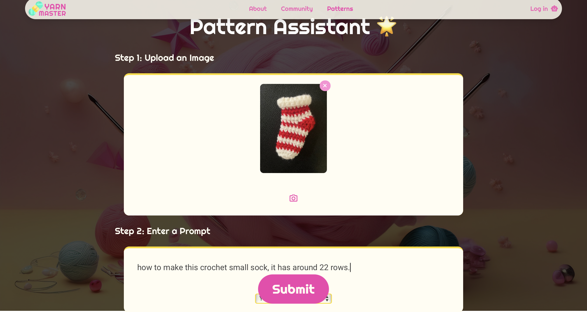
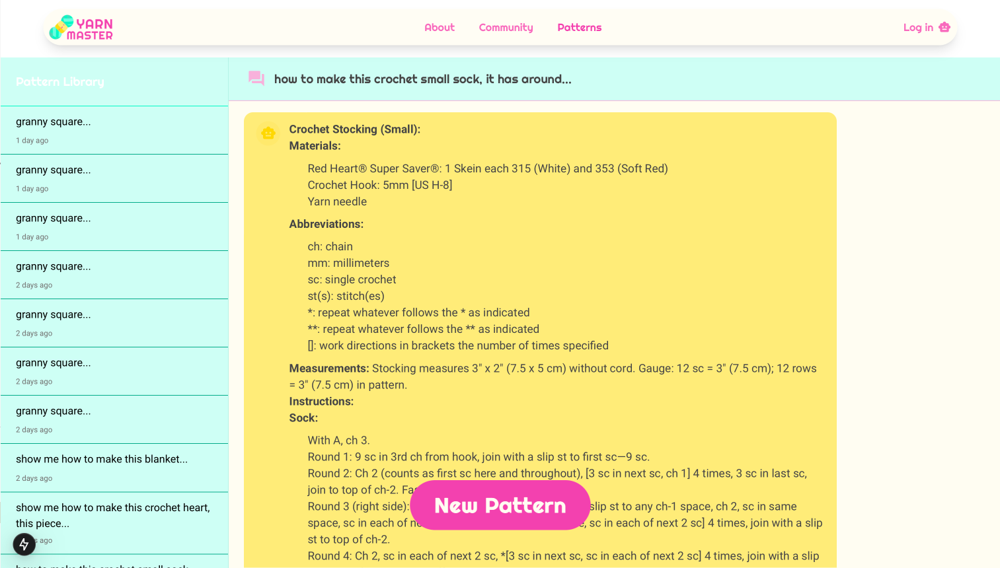

# AC215 - YarnMaster!!

Video Link: [https://youtu.be/2AV7KvwVaH](https://youtu.be/2AV7KvwVaHU)

Medium Post: [https://medium.com/@jiahuiz816/ai-powered-crochet-knit-pattern-instruction-generator-bd482cee7c7b](https://medium.com/@jiahuiz816/ai-powered-crochet-knit-pattern-instruction-generator-bd482cee7c7b)

#### Project Organization

```
├── Readme.md 
├── notebooks
│   └── combine.py
├── references/
├── reports
│   ├── APCOMP215 Proposal.pdf
│   ├── APCOMP215 Proposal_new.pdf
│   ├── milestone3.pdf
│   ├── milestone2.md
│   ├── milestone3.md
│   ├── milestone4.md
├── tests
│   ├── documentations.txt
│   ├── test_ImageDescription.py
│   ├── test_ImageVector.py
│   ├── test_integration.py
│   └── test_pdfProcessor.py
├── test_runner
│   ├── Dockerfile
│   ├── Pipfile
│   ├── Pipfile.lock
└── src
    ├── data_gathering
    │   ├── Pipfile
    │   ├── Pipfile.lock
    │   ├── docker-shell.sh
    │   ├── docker-entrypoint.sh
    │   ├── cli.py
    │   ├── data_scraping.py
    │   ├── data_upload.py
    ├── image_descriptions
    │   ├── Pipfile
    │   ├── Pipfile.lock
    │   ├── docker-shell.sh
    │   ├── docker-entrypoint.sh
    │   ├── Dockerfile
    │   ├── echo
    │   ├── cli.py
    ├── pdf_processor
    │   ├── Pipfile
    │   ├── Pipfile.lock
    │   ├── docker-shell.sh
    │   ├── docker-entrypoint.sh
    │   ├── Dockerfile·
    │   ├── cli.py
    ├── image_2_vector
    │   ├── Pipfile
    │   ├── Pipfile.lock
    │   ├── docker-shell.sh
    │   ├── docker-entrypoint.sh
    │   ├── Dockerfile
    │   ├── cli.py
    ├── gemini_finetuning
    │   ├── Pipfile
    │   ├── Pipfile.lock
    │   ├── docker-shell.sh
    │   ├── docker-entrypoint.sh
    │   ├── Dockerfile
    │   ├── gemini-finetuning.py
    │   ├── calculate.py
    ├── llama_fintuning
    │   ├── data_preprocessing.py
    │   ├── llama.py
    │   ├── llama_deploy.py
    │   ├── llama_predict.py
    │   ├── llama_reference.py
    │   ├── llama_tuning_cleaned_data.py
    │   ├── test_endpoint.py
    ├── api-service
    │   ├── Pipfile
    │   ├── Pipfile.lock
    │   ├── docker-shell.sh
    │   ├── docker-entrypoint.sh
    │   ├── Dockerfile
    │   └── api
    │       ├── service.py
    │       ├── routers
    │       │   ├── llm_rag_chat.py
    │       │   ├── llm_chat.py
    │       │   ├── llm_llama_chat.py
    │       └── utils
    │           ├── chat_utils.py
    │           ├── llm_utils.py
    │           ├── llm_rag_utils.py
    │           ├── llm_llama_utils.py
    │           └── llm_image_utils.py
    ├── vector-db
    │   ├── Pipfile       
    │   ├── Pipfile.lock           
    │   ├── Dockerfile             
    │   ├── docker-shell.sh         
    │   ├── docker-entrypoint.sh    
    │   ├── docker-compose.yml      
    │   ├── cli.py                  
    │   ├── semantic_splitter.py  
    ├── frontend_react
    │   ├── .env.development
    │   ├── .env.production
    │   ├── .gitignore
    │   ├── Dockerfile
    │   ├── Dockerfile.dev
    │   ├── docker-shell.sh
    │   ├── jsconfig.json
    │   ├── next.config.js
    │   ├── package-lock.json
    │   ├── package.json
    │   ├── postcss.config.js
    │   ├── tailwind.config.js
    │   ├── public/assets
    │   │   └── *.png
    │   └── src
    │       ├── components/
    │       ├── app/
    │       └── services/
    ├── deployment
    │   ├── nginx-conf/nginx
    │   │   └── nginx.conf
    │   ├── .dockertag          
    │   ├── .dockertag-ml  
    │   ├── Pipfile       
    │   ├── Pipfile.lock           
    │   ├── Dockerfile             
    │   ├── docker-shell.sh         
    │   ├── docker-entrypoint.sh 
    │   ├── cli.py    
    │   ├── image_descriptions.yaml
    │   ├── pdf_processor.yaml
    │   ├── pipeline.yaml
    │   ├── model_deploy.yaml
    │   ├── model_training.yaml
    │   ├── deploy-create-instance.yml
    │   ├── deploy-docker-images-app.yml
    │   ├── deploy-docker-images-ml.yml
    │   ├── deploy-k8s-cluster.yml
    │   ├── deploy-k8s-update.sh
    │   ├── deploy-provision-instance.yml
    │   ├── deploy-setup-containers.yml
    │   ├── deploy-setup-webserver.yml
    │   ├── inventory-prod.yml
    │   ├── inventory.yml
    │   ├── model.py
    │   ├── run-image-descriptions.sh
    │   ├── run-pdf-processor.sh
    │   ├── run-ml-pipeline.sh
    │   └── update-k8s-cluster.yml
 
```

# AC215 - Final Project - YarnMaster

**Team Members**\
Shiqi Wang, Yanfeiyun Wu, Jiahui Zhang, Wanying Zhang

**Group Name**\
YarnMaster

**Project**\
In this project, we aim to develop a Deep Learning model capable of interpreting images of crochet products and generating corresponding, detailed pattern instructions. Despite crochet's popularity as a creative and therapeutic pastime, enthusiasts like us often struggle to find clear, step-by-step instructions for intriguing designs we encounter online or in person due to scarce resources. Existing tools can transform written instructions into visual 3D models, but there is a significant gap in generating pattern instructions directly from images of finished products. To address this need, we envision not only creating a model that provides meaningful instructions but also developing an app tailored for crochet enthusiasts. This platform would allow users to upload pictures of crochet items they find interesting, receive detailed patterns, and foster an online community where they can connect, share their creations, and inspire each other. Here is our [project proposal](./reports/APCOMP215%20Proposal_new.pdf).

## Previous Milestones

Below are the previous milestones we've done.

- [Milestone 2](./reports/milestone2.md):
    - Data scraping from the website, data preprocessing, language model finetune and RAG. 
    - Each component are in separte contaienrs.
- [Milestone 3](./reports/milestone3.md):
    - Seprate the data preprocessing container to `pdf_processor` and `image_2_vector`.
- [Milestone 4](./reports/milestone4.md):
    - Setup frontend interface, backend API, tests for different functionalities.
    - Additional `fontend-react` and `api-service` containers.

## Final Deliverables

### Overview of YarnMaster
Yarn Master is a team of four data science students who developed a shared passion for crochet. As our skills improved, we found ourselves no longer satisfied with merely following existing patterns available online. Sometimes we wondered if we could recreate it ourselves when we came across a beautifully crafted yarn product in daily life, but we often couldn’t find precise tutorials online. Through our research, we discovered that there is currently no tool on the market that can generate accurate instructions directly from a picture of a crochet item. We also experimented with AI tools like ChatGPT to generate tutorials, but the results were far from satisfactory. Coincidentally, this semester we enrolled in Harvard’s AC215 course. When brainstorming project topics, we thought, why not create a software tool that helps crochet enthusiasts quickly generate accurate tutorials by uploading an image of their crochet product along with a detailed description?

Our project aims to help users who are interested in doing crochet works but have a hard time finding accessible instructions quickly due to the limited access to reliable, step-by-step crochet patterns and unreliable instructions generated by current AI models not specialized in crochet and knitting. By providing the image of crochet good and descriptive prompts, the crochet AI instructor will generate detailed pattern tutorials for the users.

For more information about the included features can be viewed in the `About` page in our website.


### How to use YarnMaster?

We will show you a simple tutorial of how to use YarnMaster.

Here is the homepage of our website, users can click `Quick Start` or `Patterns` to access our pattern generation feature.


On this pattern page, users can upload an image and a prompt describing the crochet piece that they want the generated instruction. Our app provide 3 different models for the users to choose from: *Yarn Bachelor*, *Yarn Master*, and *Yarn Phd*. Each model focuses on slightly different aspect of instruction generation. 
- **Yarn Bachelor** can provide accurate product size and amount of materials need for the given crochet piece.
- **Yarn Master** works well in most cases, especially for large crochet products like blanket, scarves, and etc.
- **Yarn Phd** is the most knowledgeable AI instructor and works well on small crochet goods like ornament.


Here is a sample input users can provide:



Users can view the generated tutorials in the chatting page. They can also access the previous instructions they have prompted under `Pattern Library` in the sidebar. 



Our current model has a limitation in that it cannot guarantee 100% accurate crochet instructions. To address this, we plan to integrate a feedback loop with a third-party system capable of creating crochet goods based on the generated instructions. If the created product does not closely resemble the user's input image, the system will provide feedback to our model. This feedback will enable the model to refine and regenerate instructions until the resulting product aligns with the user's expectations, ensuring continuous improvement in instruction accuracy.

### Deployment Instructions

#### App Deployment to GCP (Ansible) ####

The deployment of our application on a Google Cloud Platform (GCP) Virtual Machine (VM) is fully automated using Ansible. The process involves configuring secrets, building Docker images, setting up the VM, and deploying containers with a web server. Below is a step-by-step guide with explanations.

1. **Configuration**
   - Begin by updating the `inventory.yml` file with the following details:
     - Ansible user credentials.
     - GCP project information.
     - GCP VM instance details.
   - Ensure necessary secrets, such as SSH keys and GCP credentials, are properly set up for secure deployment.

2. **Build and Push Docker Containers**
   - Build Docker images for the application components: `vector-db`, `api-service`, and `frontend-react`.  
     - Run the command: `ansible-playbook deploy-docker-images.yml -i inventory.yml`.  
   - Push these images to the Google Container Registry (GCR).  
   - Tag all images with a timestamp to maintain consistency between components.  
   - Note: This step may take time, especially for large images like the `api-service`.

3. **Create Compute Instance**
   - Create a GCP VM configured with a mounted persistent disk for data storage.  
   - Allow HTTP traffic on port 80 and HTTPS traffic on port 443 to enable web access.  
   - Use the command: `ansible-playbook deploy-create-instance.yml -i inventory.yml --extra-vars cluster_state=present`.  
   - Once the VM is created, update the `inventory.yml` file with the compute instance's external IP address.

4. **Provision Compute Instance**
   - Set up the VM with required dependencies and configurations.  
   - This includes installing Docker, setting up the Docker network, and preparing the environment for container deployment.  
   - Use the command: `ansible-playbook deploy-provision-instance.yml -i inventory.yml`.

5. **Deploy Docker Containers**
   - Pull the pre-built Docker images from GCR and run them on the VM:
     - **Vector-DB:** Runs on port 8000.  
     - **API Service:** Runs on port 9000.  
     - **Frontend:** Runs on port 3000.  
   - Secrets (e.g., GCP credentials) are mounted into the containers to ensure secure access to necessary resources.  
   - Deploy the containers using: `ansible-playbook deploy-setup-containers.yml -i inventory.yml`.

6. **Webserver Configuration**
   - Set up Nginx as a reverse proxy to route incoming HTTP traffic between the `frontend` and `API service`:  
     - Configure `nginx.conf` with routing rules.  
     - Deploy the web server using: `ansible-playbook deploy-setup-webserver.yml -i inventory.yml`.  
   - This creates a new Nginx container to manage traffic on port 80.

7. **Access the Application**
   - Use the VM's external IP address to access the application in a web browser at: 
   ```http://<External IP>/```.

By using Ansible for automation, this deployment process is efficient and repeatable. It handles everything from building Docker images to configuring the VM and deploying containers, ensuring a streamlined setup. The application is fully accessible via the VM’s external IP, with Nginx managing traffic between components.

#### App Deployment using Kubernetes ####

This guide outlines the process for deploying the Crochet App on a Kubernetes cluster using Ansible. The deployment leverages the `deploy-k8s-cluster.yml` playbook and the `inventory.yml` configuration file for automation.

**1. Build and Push Docker Containers (Optional)**  
   - If the Docker containers for the application are not already built and pushed to the Google Container Registry (GCR), execute:  
     `ansible-playbook deploy-docker-images.yml -i inventory.yml`
   - This step builds Docker images for the frontend, API service, and ChromaDB components and pushes them to GCR, tagging the images for version control.

**2. Create and Deploy Kubernetes Cluster**  
   - Use the following command to create and configure a Google Kubernetes Engine (GKE) cluster:  
     `ansible-playbook deploy-k8s-cluster.yml -i inventory.yml --extra-vars cluster_state=present`
   - This process includes:
     1. **Cluster Creation:** Creates a GKE cluster (`crochet-app-cluster`) with autoscaling (1–2 nodes) and nodes of type `n2d-standard-2` with 30 GB disk space.
     2. **Namespace Setup:** Creates the `crochet-app-cluster-namespace` for managing Kubernetes resources.
     3. **Ingress Controller:** Installs Nginx ingress using Helm for external access to cluster services.
     4. **Persistent Volume Claims:** Sets up PVCs for app data storage and ChromaDB storage.
     5. **Secrets Management:** Imports GCP credentials into the cluster as Kubernetes secrets for secure access.
     6. **Application Deployment:** Deploys:
        - **Frontend Service** (exposed on port 3000).  
        - **API Service** (exposed on port 9000 with GCP credentials and persistent storage).  
        - **ChromaDB Service** (exposed on port 8000 with persistent storage).
     7. **Data Initialization:** Executes a Kubernetes job to load initial data into ChromaDB.
     8. **Service Exposure:** Creates NodePort services for frontend, API, and ChromaDB components.
     9. **Ingress Configuration:** Sets up routing to:
        - `/` for frontend traffic.  
        - `/api/` for API service traffic.

**3. Access the Application**  
   - After successful deployment, retrieve the ingress IP from the terminal output.
   - Open the app in a web browser using:  
     ```http://<INGRESS IP>.sslip.io```

This deployment process automates the setup of a Kubernetes cluster, the configuration of resources, and the deployment of services. It ensures scalability, security, and efficient resource management for the Crochet App, making it accessible via the provided ingress IP.

### CI/CD: Github Actions

We've implemented Github Actions workflow to perform: (1) tests of each containers, (2) integration tests between multicontainers, (3) automated update to our Kunernetes cluster, and (4) automated retrain when we gather new data. Here are the commands in commit that will trigger the these actions:
- The unit tests in each container and integration tests between multicontainers will run everytime when we push new changes to the main branch.
- Adding ` /deploy-app` at the end of the commit message will automatically update our deployed app on the kubernetes cluster.
- Adding `/run-pdf-processor` at the end of the commit message will automatically process the pdfs we've gathered and upload the images and text instructions to the GCS buckets.
- Adding `/run-image-description` at the end of the commit message will automatically retrieve image descriptions and clean raw text instructions using LLMs that we gathered from the PDF processing step.
- Adding `/run-ml-pipeline` at the end of the commit message will automatically trigger the workflow for data preprocessing (including pdf processing, image description, and text cleaning) and retraining the model we currently have. After the model is retrained, since our generated instructions are hard to evaluate using a loss function to check their performance, we incorporate an additional validation step to ensure that the model performs as expected. If the validation is successful, we will finally deploy the updated model for use.

The CI/CD automations allows us to easily update the deployed app without restarting our server when we make some update with our code, such as a newly implemented feature or version update of our model. 

### Prerequisites

Our app is fully implemented using containers, which mean it is necessary to have access to the Docker Container. To run the Docker container locally, ensure that Docker is installed and running on your system. You should also have access to the required secrets, such as GCP credentials and SSH keys, properly set up in the `/secrets` directory. Verify that you have configured the `inventory.yml` file with accurate project details, including the GCP project ID and authentication settings. Additionally, confirm that your system has access to the internet to pull necessary images and authenticate with GCP. Finally, check that your Docker environment has sufficient resources (CPU, memory, and disk space) to run the container smoothly.

### Setup Instructions

This is the instruction for setting up the deployment process for the first time.

1. **Setup Docker Container**  
   - Use Docker to create a deployment container with all required tools.  
   - Update `docker-shell.sh` with your GCP project ID and run `sh docker-shell.sh`.  
   - Verify tools with `gcloud`, `ansible`, and `kubectl` commands.  
   - Authenticate to GCP with `gcloud auth list`.

2. **SSH Setup**  
   - Enable OS Login: `gcloud compute project-info add-metadata --project <YOUR GCP_PROJECT> --metadata enable-oslogin=TRUE`.  
   - Generate SSH key: `ssh-keygen -f /secrets/ssh-key-deployment`.  
   - Add public SSH key to GCP: `gcloud compute os-login ssh-keys add --key-file=/secrets/ssh-key-deployment.pub`.  
   - Note the generated username for later use.

ENJOY!


